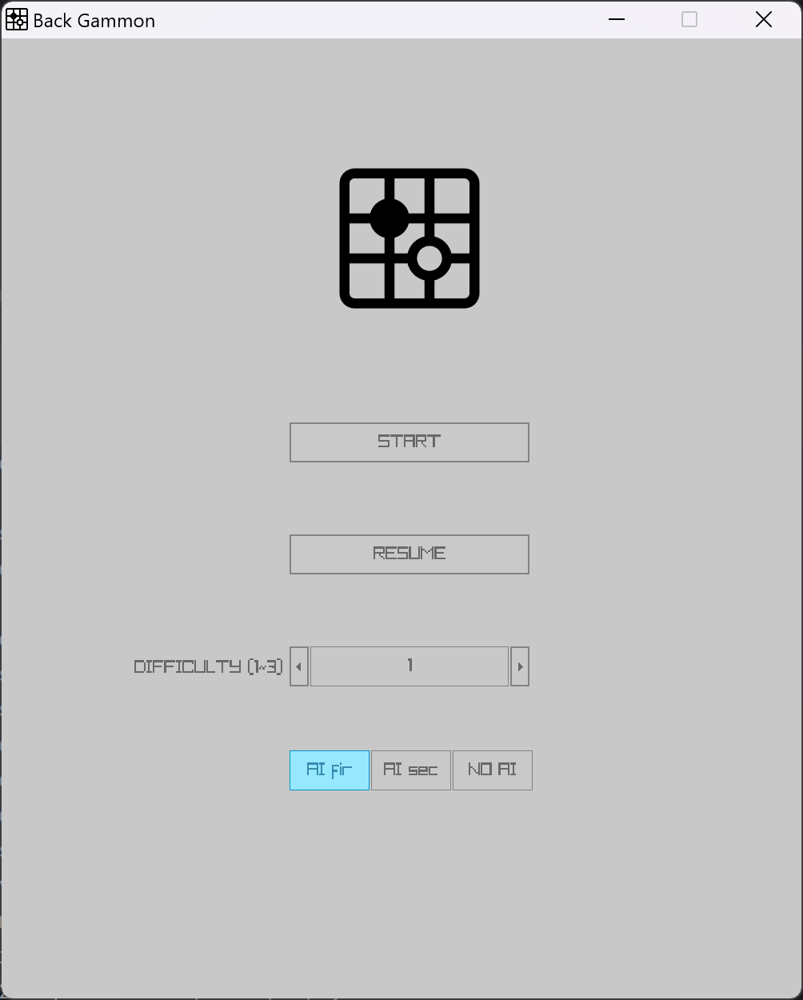

# AI五子棋

## 需求

1. **用户界面（UI）**：
   - **直观的界面设计：** 界面应简洁、直观，使用户能够轻松理解和使用。
   - **棋盘显示：** 清晰的棋盘显示，支持标识当前棋局状态和最新下棋的位置。
2. **游戏模式**：
   - **人机对战：** 提供与计算机AI进行对战的功能，AI应具有不同难度级别，以满足各种玩家水平。
   - **双人对战：** 允许两名玩家在同一设备上进行对战。
3. **AI算法**：
   - **启发式搜索：** 使用启发式搜索算法实现人机对战的AI，以确保对战的挑战性。
   - **可调难度级别：** 提供不同难度级别的AI，以满足初学者到高级玩家的需求。
4. **数据存储**：
   - **游戏记录：** 自动保存对战记录，以便玩家可以回顾和分享。
5. **用户交互**：
   - **棋盘交互：** 提供简便的方式让玩家在棋盘上选择和落子。
   - **撤销和悔棋：** 允许玩家悔棋，提高用户体验。
   - **切换黑白子：** 允许玩家在游玩的时候“前进一步”，达到“解残局”的游玩方式。


## 程序外观

### 主界面



### 游戏界面


### 胜利界面


### 操作方式

- 鼠标点按（符合直觉的）
- 方向左键：撤回（隐藏功能 不提示用户）
- 方向右键：电脑帮忙下一个子（在人机对战的情况下）（隐藏功能 不告诉用户）


## 设计

整个设计采用类来划分功能


- **Application** 实现了对整个应用程序的生命管理，包括对窗口初始化的执行和窗口关闭的类的销毁
- **Scene** 实现对整个场景的绘画任务，是程序运作的核心部位，我将仔细讲解：
  - 它首先接受来自Application的更新和绘画的任务
  - 然后在自身管理的对象池里有优先级的更新对象，同时收集event和实时添加对象
  - 遍历完后开始处理event，将控制权移交给eventManager，同时接受来自eventManager的修改对象的请求
  - 处理完event后就开始按顺序绘画
- **EventManager** 是一个处理event的函数，实现统一化管理决策，内部指令具有优先级保证功能的正确性
- **ChessManager** 是一个管理棋盘的的类，主要储存一系列棋盘的状态方便scene修改对象和帮助eventManager决策
- **ChessEngine** 是主要的游戏引擎，所有需要对棋子进行计算分数或者统计信息的操作都在这里完成
- **AC Engine** 是AC自动机算法的引擎，处理多模式字符串匹配加速估值
- **GameObject Pool** 里面的所有对象都继承自`GameObject` 具有可绘画和可更新的特征，其中UI借用了第三方库RAYGUI完成UI的绘制
- **Benchmark** 是测试用类，用来统计每个函数的用时来优化程序结构


## 实现


## 框架的搭建

最初的想法和现在差不多，考虑游戏围绕update&draw运行，不过event的解耦始终非常困难，因为其中的决策又要用到很多棋盘的信息，不能只靠一个event触发就无脑运行一个功能（如悔棋）

于是一开始设计成Scene决策和绘画一体的模式

```c++
void Scene::Update() {
    if (!IsWindowsStatic) {//窗口能获取信息
        if (cnt % 2) {//到电脑下了
            ...
            return;
        }

        if (IsMouseButtonPressed(MOUSE_BUTTON_LEFT)) {
            ...

            if (SomeoneWin(roundVec)) {
                m_gameObjects.push_back(new Message(cnt % 2 ? "Black Wins!!" : "White Wins!!"));
                IsWindowsStatic = true;
            }
            return;
        }

    }
}
```

很明显，非常混乱不利于debug，于是小修一下包装了功能

```cpp
void Scene::Update() {
    if (IsWindowsStatic) return;
    if (isWantToCancel()) {
        cancelOneStep();
        if (haveComputerHere()) {
            cancelOneStep();
        }
    }
    if (isWantToSwitchPlayer()) {
        switchPlayer();
    }
    if (isComputerNow()) {
        computerDownOneStep();
    }
    if (isHunanNow() and isPlayerClickOnBoardAndValid()) {
        humanDownOneStep();
    }
    if (someoneWin()) {
        IsWindowsStatic = true;
        showWinMessage();
    }
}
```

这个在单单棋盘界面的时候是没有问题的，但是一旦加进来主菜单的时候就会非常混乱了

所以又把event请回来了，同时为了方便把eventManager、chessManager和Scene都弄成单例的模式

后来发现多此一举，又全部弄成静态的方法来管理

最后就变成了这样的：

```cpp
void Scene::Update() {
    for (GameObject *obj: m_gameObjects) {
        if (obj->m_isActive) {
            EventManager::AddEvent(obj->Update());
        }
    }
    if (EventManager::IsGaming()) {
        EventManager::AddEvent(ChessManager::update());
    }
    EventManager::Update();
}
```

因为所有能够画出来的对象都有统一的接口，所以绘画非常的方便。

之后update就交给EventManager来决策了，那么信息如何传递呢，我用的是enum枚举：

```cpp
enum Event {
    EVENT_NONE = 0,
    EVENT_IS_WANT_TO_RETURN_TO_MAIN_MENU = 1,
    
    ...
        
    EVENT_SET_GAME_MODE_AI_SECOND = 210,
    EVENT_SET_GAME_MODE_NO_AI = 211,
};
```

任何一个出现在游戏里的对象都能够通过update返回一个event来激活一个事件。而这个event最终会传递eventManager处理。eventManager把event统一暂存（优先队列）再统一处理。

eventManager的处理：

```cpp
void EventManager::Update() {
    while (!m_eventQueue.empty()) {
        Event event = m_eventQueue.top();
        m_eventQueue.pop();
        switch (event) {
            case EVENT_IS_WANT_TO_CANCEL:
                cancelOneStep();
                if (!ChessManager::thereIsNoComputer()) {
                    cancelOneStep();//人机对战模式撤回两次
                }
                break;
                
            ...
                
            case EVENT_IS_WANT_TO_RETURN_TO_MAIN_MENU:
                ChessEngine::searchFloor = 3;
                ChessManager::computerIsPWhat = 1;
                IS_GAMING = false;
                IS_GAME_OVER = false;
                Scene::m_gameObjects.clear();
                Scene::AddObject(new UI);
                ChessManager::saveState();
                ChessManager::clear();
                break;
            case EVENT_NONE:
                break;
        }
    }
}
```

这样便很好的分离了决策和绘画的功能，并且加强了程序的扩展性。


## 核心算法模块 ChessEngine

一开始没有这个模块而是把它和chessManager放在一起，但是考虑到分离管理和计算两个任务，所以分了这个模块出来

ChessEngine对外的接口有4个：

- **InitMap** 用于获取棋盘的状态数组。元素必须为0，1，2中的一个
- **getMaxCoord** 用于获取当前棋盘分数最高的坐标位置（也就是最优解的坐标）
- **someOneWin** 用来确认当前是否有人已经赢了
- **searchFloor** 储存搜索层数，用来调节难度


